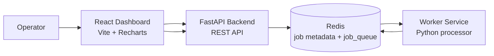
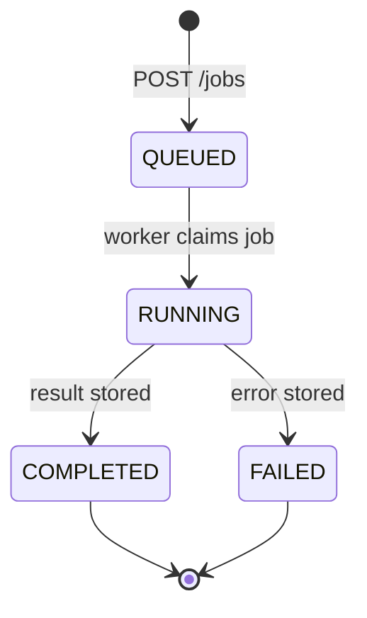

# Cloud Task Orchestrator

Cloud Task Orchestrator is a production-style cloud-native task orchestration platform for submitting, queueing, processing, and observing asynchronous background jobs.

It includes a FastAPI service, Redis-backed job queue, horizontally runnable worker service, Docker Compose local stack, local Kubernetes manifests, and a polished React dashboard for job submission, queue visibility, health checks, job inspection, and observability charts.

The project is intentionally scoped to a local cloud-native foundation: clean service boundaries, containerized components, real Redis state, local Kubernetes deployment files, and a dashboard that uses live API responses.

## Architecture



Job lifecycle:



Core services:

- **Frontend dashboard**: Vite + React interface for submitting jobs, inspecting results, and viewing live charts.
- **Backend API**: FastAPI service that validates requests, stores job metadata, and enqueues job IDs.
- **Redis**: Queue and metadata store. Job IDs are pushed into `job_queue`.
- **Worker**: Python service that consumes job IDs, updates status, processes payloads, and writes results.
- **Docker Compose**: Local multi-service runtime with internal networking and health checks.
- **Kubernetes**: Local-dev manifests for Docker Desktop Kubernetes or minikube.

More detail: [docs/architecture.md](docs/architecture.md)

## Features

- Submit asynchronous jobs from the API or dashboard.
- Supported task types:
  - `text_transform`: uppercase text, reversed text, word count.
  - `file_summary`: simple extractive summary from a text field.
  - `data_cleanup`: removes null, empty string, and empty list values.
- Redis-backed job metadata and queue.
- Worker-safe queue consumption for multiple worker replicas.
- Job statuses: `QUEUED`, `RUNNING`, `COMPLETED`, `FAILED`.
- Result, error, retry count, created timestamp, and updated timestamp tracking.
- Dashboard health cards for API, Redis, and job counts.
- Queue pipeline visualization.
- Worker insights panel.
- Recharts observability visuals derived from real `GET /jobs` data.
- Light, dark, and system theme support with local preference persistence.
- Dockerized frontend, backend, worker, and Redis.
- Kubernetes manifests with probes, resource requests/limits, and worker autoscaling.
- Smoke test script for end-to-end local validation.

## Tech Stack

| Layer | Technology |
| --- | --- |
| Frontend | Vite, React, Recharts, Lucide React |
| Backend API | FastAPI, Pydantic, Uvicorn |
| Queue and store | Redis 7 |
| Worker | Python, redis-py |
| Local runtime | Docker Compose |
| Local orchestration | Kubernetes manifests |
| Packaging | Dockerfiles per service |

## Repository Structure

```text
backend/
  app/
    main.py
    models.py
    redis_client.py
    job_store.py
  Dockerfile
  requirements.txt
frontend/
  src/
    api/
    components/
    utils/
  Dockerfile
  package.json
worker/
  worker.py
  Dockerfile
  requirements.txt
scripts/
  smoke_test.sh
docs/
  architecture.md
  demo-flow.md
  kubernetes.md
  screenshots.md
k8s/
  namespace.yaml
  configmap.yaml
  redis.yaml
  backend.yaml
  worker.yaml
  frontend.yaml
docker-compose.yml
```

## Quick Start With Docker Compose

Prerequisites:

- Docker
- Docker Compose plugin

Start the full local stack:

```bash
docker compose up --build
```

Services:

| Service | URL / Access |
| --- | --- |
| Frontend dashboard | `http://localhost:5173` |
| Backend API | `http://localhost:8000` |
| API docs | `http://localhost:8000/docs` |
| Redis | Internal Compose network only |
| Worker | Internal service, no exposed port |

Stop the stack:

```bash
docker compose down
```

Reset local Redis state:

```bash
docker compose down
docker compose up --build
```

If Redis data is persisted by your Docker environment or you add volumes later, remove the related volume before restarting.

## Frontend Dashboard

Open the dashboard:

```text
http://localhost:5173
```

The dashboard supports:

- Submit Job form with task type selection and JSON payload editor.
- Jobs table with selected row state.
- Sticky job inspector with payload, result, error, retry count, and timestamps.
- System Snapshot panel when no job is selected.
- Health summary cards.
- Queue pipeline and worker insights.
- Throughput, status, and task type charts derived from `GET /jobs`.
- Static system architecture card.
- Light, dark, and system theme toggle.

Direct frontend development:

```bash
cd frontend
npm install
VITE_API_URL=http://localhost:8000 npm run dev
```

The dashboard does not use fake random data. If the backend is unreachable, it shows an explicit error state.

## Kubernetes

Local Kubernetes manifests are available in `k8s/`.

Build local images:

```bash
docker compose build
```

Apply manifests:

```bash
kubectl apply -f k8s/
```

Port-forward the backend and frontend in separate terminals:

```bash
kubectl -n cloud-task-orchestrator port-forward svc/backend 8000:8000
kubectl -n cloud-task-orchestrator port-forward svc/frontend 5173:5173
```

Then open:

```text
http://localhost:5173
```

The worker deployment starts with 2 replicas and includes a HorizontalPodAutoscaler that can scale workers up to 5 replicas.

More detail: [docs/kubernetes.md](docs/kubernetes.md)

## API Examples

Health:

```bash
curl http://localhost:8000/health
```

Create a `text_transform` job:

```bash
curl -X POST http://localhost:8000/jobs \
  -H "Content-Type: application/json" \
  -d '{"task_type":"text_transform","payload":{"text":"cloud task orchestrator"}}'
```

Create a `file_summary` job:

```bash
curl -X POST http://localhost:8000/jobs \
  -H "Content-Type: application/json" \
  -d '{"task_type":"file_summary","payload":{"text":"Cloud Task Orchestrator receives jobs through FastAPI. Redis queues job identifiers. Workers process each job and write results for the dashboard to inspect."}}'
```

Create a `data_cleanup` job:

```bash
curl -X POST http://localhost:8000/jobs \
  -H "Content-Type: application/json" \
  -d '{"task_type":"data_cleanup","payload":{"name":"daily-import","owner":"","tags":["etl","",null],"metadata":{"region":"us-central1","notes":null}}}'
```

List jobs:

```bash
curl http://localhost:8000/jobs
```

Get one job:

```bash
curl http://localhost:8000/jobs/<job_id>
```

## Smoke Test

Run the local stack first:

```bash
docker compose up --build
```

In another terminal:

```bash
./scripts/smoke_test.sh
```

The smoke test:

1. Calls `GET /health`.
2. Submits a `text_transform` job.
3. Polls `GET /jobs`.
4. Stops when the job reaches `COMPLETED` or `FAILED`.
5. Prints the final job JSON.

Optional environment variables:

```bash
API_BASE_URL=http://localhost:8000 POLL_INTERVAL_SECONDS=1 MAX_ATTEMPTS=60 ./scripts/smoke_test.sh
```

## Configuration

Backend and worker:

| Variable | Default / Compose value | Purpose |
| --- | --- | --- |
| `REDIS_HOST` | `redis` in Compose | Redis hostname |
| `REDIS_PORT` | `6379` | Redis port |
| `CORS_ORIGINS` | `http://localhost:5173` | Allowed frontend origin |

Frontend:

| Variable | Default / Compose value | Purpose |
| --- | --- | --- |
| `VITE_API_URL` | `http://localhost:8000` | Browser-visible API URL |

## Troubleshooting

**Dashboard shows "Backend unreachable"**

- Confirm the backend is running: `docker compose ps`.
- Check backend logs: `docker compose logs backend`.
- Confirm `VITE_API_URL` points to `http://localhost:8000` for local Compose.
- Confirm CORS allows `http://localhost:5173`.

**Jobs stay QUEUED**

- Check the worker is running: `docker compose ps worker`.
- Check worker logs: `docker compose logs worker`.
- Confirm Redis is healthy: `docker compose ps redis`.

**Backend health returns Redis unavailable**

- Check Redis logs: `docker compose logs redis`.
- Confirm backend uses `REDIS_HOST=redis` and `REDIS_PORT=6379` in Compose.

**Port already in use**

- Stop existing services using ports `5173` or `8000`.
- Or update the published ports in `docker-compose.yml`.

**Frontend dependency issues**

```bash
cd frontend
npm install
npm run build
```

**Python import issues**

Use Docker Compose for the quickest consistent runtime. For local Python development, install the service requirements in `backend/requirements.txt` or `worker/requirements.txt`.

## Documentation

- [Architecture](docs/architecture.md)
- [Demo flow](docs/demo-flow.md)
- [Kubernetes](docs/kubernetes.md)
- [Screenshot checklist](docs/screenshots.md)

## Roadmap

- Add persistent Redis volumes for optional local state retention.
- Add worker retry policy configuration and dead-letter queue behavior.
- Add job cancellation and requeue endpoints.
- Add pagination and filtering for the jobs table.
- Add structured API tests and worker integration tests.
- Add authentication and role-aware dashboard views.
- Add hardened production deployment options in a future phase.

## License

Add a license before publishing publicly.
