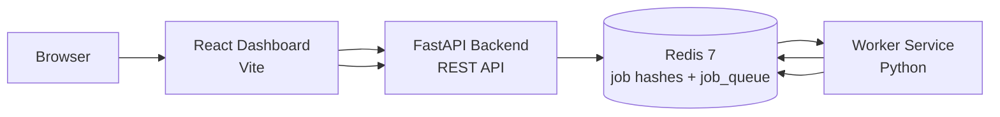
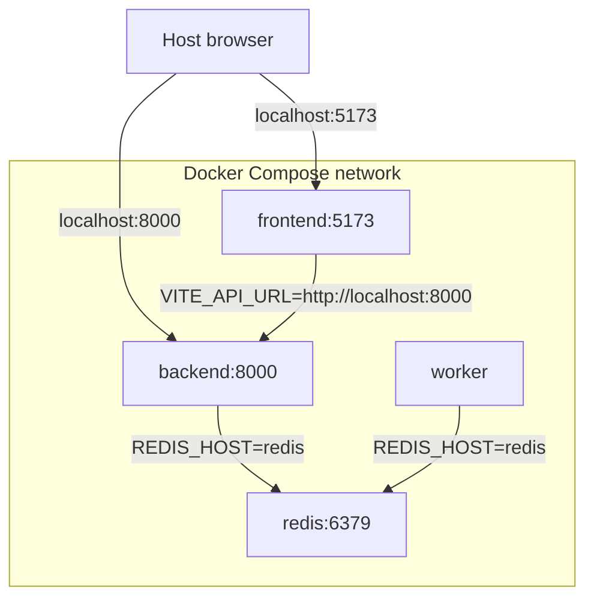
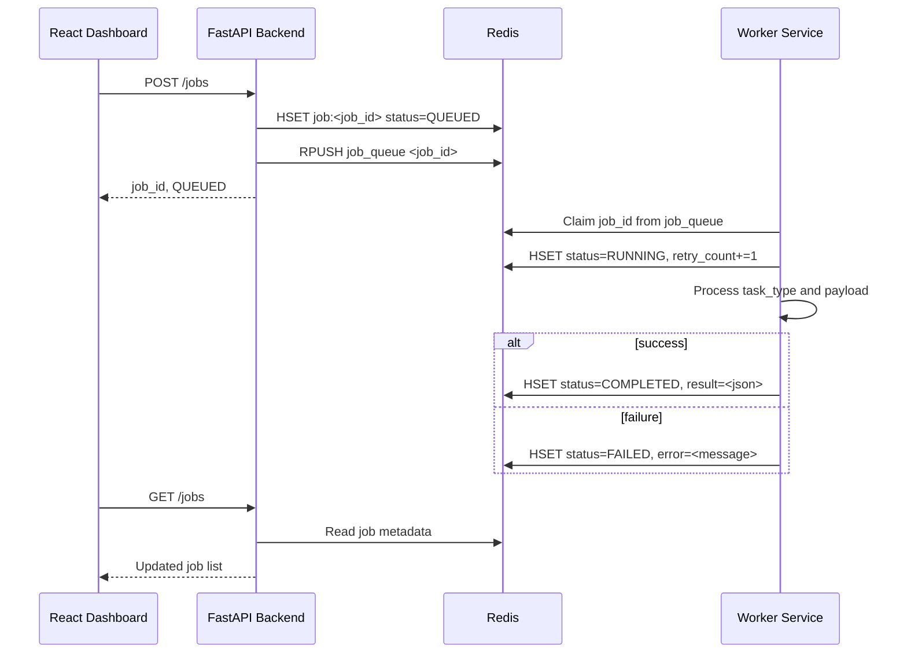
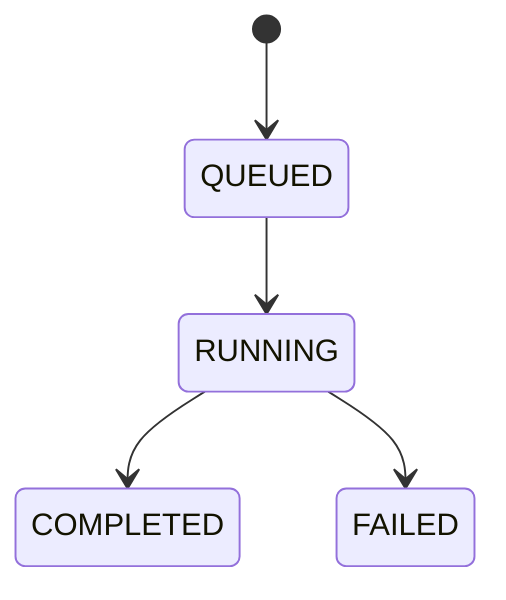

# Architecture

Cloud Task Orchestrator is split into independently containerized services that can run through Docker Compose or local Kubernetes. The system models a common cloud-native pattern: an API accepts work, Redis stores queue state, workers process jobs asynchronously, and a dashboard provides operator visibility.

## System Diagram

## Service Responsibilities

### React Dashboard

The dashboard is the operator-facing control plane.

Responsibilities:

- Submit jobs through the backend API.
- Display API and Redis health.
- Show total, queued, running, completed, and failed job counts.
- Render queue pipeline and worker insights.
- Display Recharts visualizations derived from `GET /jobs`.
- Inspect job payload, result, error, retry count, and timestamps.
- Provide light, dark, and system theme modes.

The dashboard reads the API base URL from `VITE_API_URL`.

### FastAPI Backend

The backend owns request validation and job creation.

Responsibilities:

- Expose `GET /health`.
- Expose `POST /jobs`.
- Expose `GET /jobs`.
- Expose `GET /jobs/{job_id}`.
- Validate supported task types with Pydantic models.
- Generate UUID job IDs.
- Store job metadata in Redis.
- Push job IDs into the Redis list queue named `job_queue`.

The backend reads Redis connection settings from `REDIS_HOST` and `REDIS_PORT`.

### Redis Queue

Redis is both the queue and the job metadata store.

Current key patterns:

- `job:<job_id>`: Redis hash containing job metadata.
- `jobs:index`: Redis list used by the backend for job listing.
- `job_queue`: Redis list used as the worker queue.
- `job_queue:processing`: Redis list used by workers while processing claimed jobs.

Redis is internal to the Docker Compose network and is not published to the host by default.

### Worker Service

The worker consumes queued jobs and writes results.

Responsibilities:

- Connect to Redis using `REDIS_HOST` and `REDIS_PORT`.
- Claim job IDs from `job_queue`.
- Mark jobs `RUNNING`.
- Process supported task types.
- Store `result` on success.
- Store `error` on failure.
- Increment `retry_count`.
- Mark jobs `COMPLETED` or `FAILED`.
- Emit structured JSON logs.

Workers can be scaled horizontally because each worker claims job IDs from Redis atomically.

## Docker Compose Networking

Docker Compose creates an internal network where services can reach each other by service name.

Important detail: `VITE_API_URL` is used by browser JavaScript, so in local Compose it points to `http://localhost:8000`, not `http://backend:8000`.

## Job Lifecycle

State transition:

## Task Types

| Task type | Input | Result |
| --- | --- | --- |
| `text_transform` | `payload.text` string | uppercase text, reversed text, word count |
| `file_summary` | `payload.text` string | simple extractive summary, sentence count, word count |
| `data_cleanup` | JSON object | payload with null, empty string, and empty list values removed |

## Failure Handling

Malformed or unsupported jobs are handled by the worker:

- The worker logs the failure.
- The job is marked `FAILED`.
- The error message is stored in Redis.
- The job is acknowledged from the processing queue.

Backend Redis failures return structured HTTP errors so the dashboard can show an explicit unreachable/error state.
